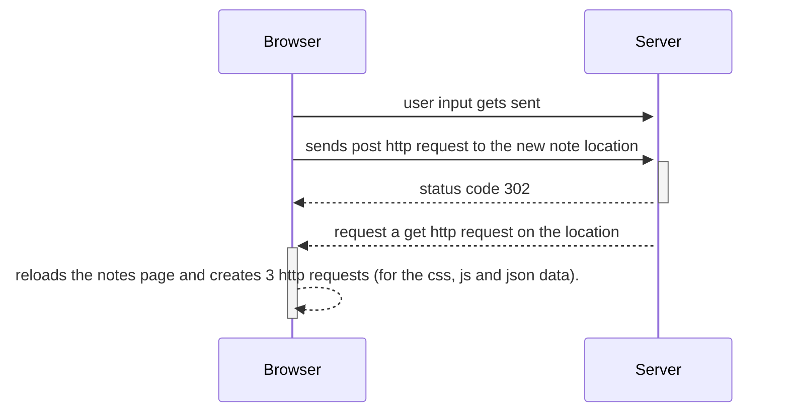

```mermaid
sequenceDiagram
    Browser->>+Server: user input gets sent
    Browser->>+Server: sends post http request to the new note location
    Server-->>-Browser: status code 302
    Server-->>+Browser: request a get http request on the location
    Browser-->>-Browser: reloads the notes page and creates 3 http requests (for the css, js and json data).
```
